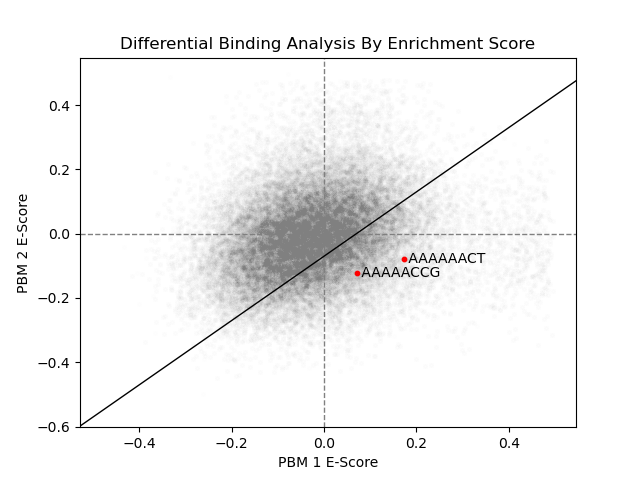

# tfsites.DifferentialBindingAnalysis v1

**Author(s):** Joe Solvason  

**Contact:** Joe Solvason (solvason@eng.ucsd.edu)

**Adapted as a GenePattern Module by:** Ted Liefeld (jliefeld@cloud.ucsd.edu)

**Task Type:** Transciption factor analysis

**LSID:**  urn:lsid:genepattern.org:module.analysis:00446


## Introduction

`differentialBindingAnalysis` plots the enrichment scores (e-scores) from two PBM datasets against each other. This allows us to assess whether differential binding occurs between the two transcription factors. 


## Methodology

The raw PBM datasets for two transcription factors are downloaded from [uniPROBE](http://the_brain.bwh.harvard.edu/uniprobe/). For each file, the user indicates the columns of the forward k-mer sequences and e-scores. For each k-mer sequence, its e-score from the first PBM file is plotted against its e-score from the second PBM file. Therefore, each data point in the plot is a k-mer with the ordered pair: (PBM 1 e-score, PBM 2 e-score). To indicate whether differential binding occurs, the resulting scatterplot can have either a trendline of the data points or a line with a slope of 1. 

## Parameters

### First Dataset

<span style="color: red;">*</span> indicates required parameter

- <span style="color: red;">*</span>**raw PBM input for first TF (.tsv)**
    - Input file containing the raw PBM dataset for the first transcription factor of interest obtained from uniPROBE.
- <span style="color: red;">*</span>**Header Present PBM data for first TF (boolean)**
    - If `True`, a header exists in the first PBM data file. If `False`, no header exists.
- <span style="color: red;">*</span>**Column Index of K-mers in First PBM File (integer)**
    - Number of the column containing the forward DNA sequence in the first PBM file. (1-indexed, 1 is the first column)
- <span style="color: red;">*</span>**Column Index of E-Scores in First PBM File (integer)**
    - Number of the column containing the e-score in the first PBM file. (1-indexed, 1 is the first column)
      
### Second Dataset

- <span style="color: red;">*</span>**raw PBM input for second TF (.tsv)**
    - Input file containing the raw PBM dataset for the second transcription factor of interest obtained from uniPROBE.
- <span style="color: red;">*</span>**Header Present in Second PBM File (boolean)**
    - If True, a header exists in the first PBM data file. If False, no header exists.
- <span style="color: red;">*</span>**Column Index of K-mers in Second PBM File (integer)**
    - Number of the column containing the forward DNA sequence in the second PBM file. (1-indexed, 1 is the first column)
- <span style="color: red;">*</span>**Column Index of E-Scores in Second PBM File (integer)**
    - Number of the column containing the e-score in the second PBM file. (1-indexed, 1 is the first column)

      
### Other Parameters

- **k-mers to label on plot (comma-separated string)**
    - `Default = None`
    - Comma-separated list of kmers to be labeled on the plot.
- **alpha threshold for dot transparency(float)**
    - `Default = 1`
    - Alpha threshold that sets the transparency for data points, to show where most data points are concentrated.
- **draw trendline (boolean)**
    - Default = `False`
    - If `True`, plot a line of regression through the data points. If `False`, plot a line through (0,0) with a slope of 1.
- <span style="color: red;">*</span>**scatterplot of enrichment score comparison output filename (.png)**
    - Name of the output file containing a scatterplot of the enrichment scores (e-scores) from the first PBM dataset plotted against the e-scores from the second PBM dataset. 

## Input Files

1.  Raw PBM Input For First TF (.tsv)
- Columns
  - `8-mer:` every possible forward k-mer sequence with length k
  - `8-mer:` the reverse complement of the forward k-mer
  - `E-score:` the enrichment score of the k-mer
  - `Median:` the median fluorescence intensity of the k-mer
  - `Z-score:` the z-score of the k-mer

```
8-mer        8-mer        E-score     Median      Z-score
AAAAAAAA     TTTTTTTT     0.29130     2871.60     3.5965
AAAAAAAC     TTTTTTTG     0.10748     2086.00     0.3958
AAAAAAAG     TTTTTTTC     0.23656     2539.91     2.3673
AAAAAAAT     TTTTTTTA     0.21760     2434.82     1.9442
AAAAAACA     TTTTTTGT     0.19839     2407.46     1.8310
```

2.  Raw PBM Input For Second TF (.tsv)
- Columns
  - `8-mer:` every possible forward k-mer sequence with length k
  - `8-mer:` the reverse complement of the forward k-mer
  - `E-score:` the enrichment score of the k-mer
  - `Median:` the median fluorescence intensity of the k-mer
  - `Z-score:` the z-score of the k-mer

```
8-mer        8-mer        E-score     Median      Z-score
AAAAAAAA     TTTTTTTT     0.04621     1378.79     0.0023
AAAAAAAC     TTTTTTTG     0.05236     1595.93     1.2232
AAAAAAAG     TTTTTTTC     0.11724     1515.64     0.7923
AAAAAAAT     TTTTTTTA     0.04593     1390.77     0.0745
AAAAAACA     TTTTTTGT     0.11884     1477.50     0.5795
```
       
## Output Files

  1. Scatterplot of Enrichment Scores (.png)

   
    
  
## Example Data

[Example input data is available on github](https://github.com/genepattern/tfsites.annotateTfSites/data)
    
    
## Version Comments


- **1.0.2** (2024-05-10): Updated parameter names.
- **1.0.1** (2024-02-02): Draft completed.
- **1.0.0** (2023-11-28): Initial draft of document scaffold.
